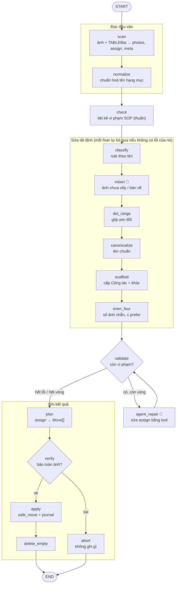
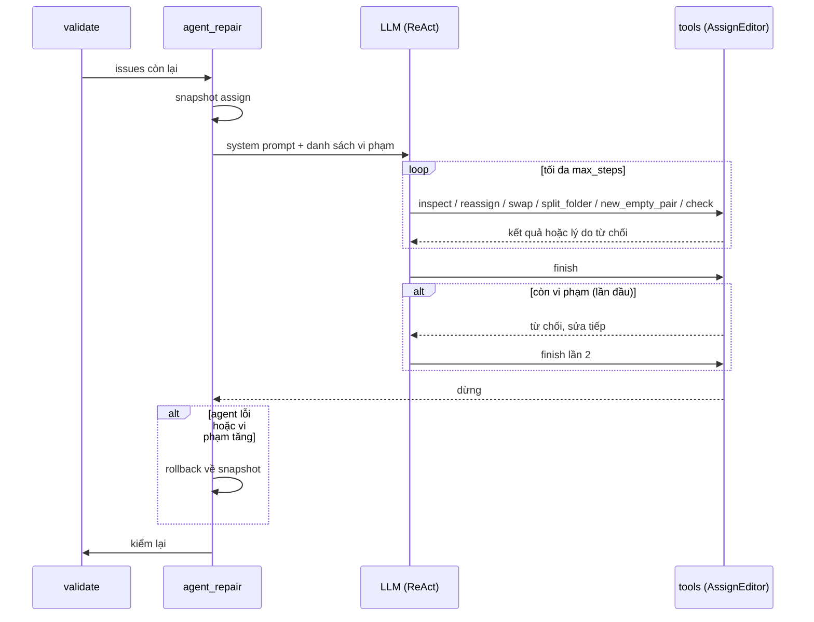

# KIẾN TRÚC — photo-sort

> Tài liệu cho người phát triển và bảo trì. Mô tả code **hiện tại** (09/2026).
> Mọi thay đổi phải giữ hoặc tăng số đo `photo-sort-eval` trên **tất cả** trạm có GT (§9).

## 1. Bài toán và ràng buộc

Nhận thư mục ảnh thô của một trạm BTS và xuất ra cây thư mục phụ lục đúng SOP:
hạng mục → cặp "Công tác chuẩn bị / đo" → "Hình ảnh khác". File được đổi tên theo quy ước,
và **không mất hay đè ảnh nào**.

| Ràng buộc | Hệ quả thiết kế |
|---|---|
| Ảnh của khách hàng: mất ảnh là sự cố | Không sửa input. Luồng là plan → verify (chặn cứng) → apply. Journal cho phép resume |
| Nhiều trạm, nhiều loại cột, SOP thay đổi | Code là cơ chế trung lập, SOP là dữ liệu trong `rules/*.toml` |
| Ảnh mơ hồ không có đáp án chắc chắn | Chưa chắc thì đưa vào mục "cần người xem", không đoán |
| LLM không tất định và tốn tiền | Chạy tất định trước, LLM sau cùng, có cache, có ngân sách, có giới hạn số bước, có hoàn tác |
| Code và rules là IP | Khách chỉ nhận `.pyc`, rules nhúng trong bytecode (§8) |
| Windows, đường dẫn dài | Mọi I/O đi qua `infrastructure/filesystem`, an toàn với MAX_PATH |

## 2. Nguyên tắc

1. **SOP là data, code là cơ chế.** Trong `src/` không có chuỗi, regex hay con số nào của SOP. Thêm loại cột hoặc quy tắc mới thì sửa TOML.
2. **Tổng quát, không vá riêng.** Không viết nhánh code cho riêng một trạm.
3. **Tất định trước, LLM sau.** LLM chỉ xử lý phần rule không quyết được, và chỉ chọn trong tập đóng.
4. **Chẩn đoán → sửa đúng chỗ → kiểm lại** (vòng reconcile), không phải chuỗi biến đổi mù.
5. **Bảo toàn là bất biến cứng.** Bước kiểm tra nằm riêng (`verify`), không giao cho bước sửa nào.
6. **Chỉ gọi là cải thiện khi đo được** bằng harness GT trên nhiều trạm.

## 3. Bố cục mã nguồn

```
app/                       lớp giao tiếp — chỉ parse tham số rồi gọi application
  cli/commands.py          photo-sort · photo-sort-eval · photo-sort-engine
  api/                     FastAPI: job bất đồng bộ, stream sự kiện cho UI
  ui/                      Bun + OpenTUI (terminal UI); tự bật backend; build ra ui.exe
src/                       lõi, xếp theo tầng
  application/services     sort_photos() → SortResult ; run_graph (run_id, report)
  pipeline/                dựng LangGraph cho feature photo-sort (pipeline.py, feature.py)
  steps/                   15 node của graph (§4)
  agent/                   agent LLM (create_agent), prompt, vision (structured output)
  tools/                   tool cho agent: repair.py (sửa assign), look.py (xem ảnh)
  runtime/                 engine chung: @node, RunContext, runner, registry plugin
  domain/                  logic thuần: state, profile, naming, folders, matching, filename…
  infrastructure/          filesystem · llm (client, usage, giá) · observability · persistence
  config/                  settings.py (pydantic-settings, biến LLM_*) · loader rules
  evaluation/              so kết quả với GT theo sha1
rules/                     _base.toml · day_co.toml · tu_dung.toml  (SOP)
scripts/                   build_dist.py · make_eval_fixture.py
npm/                       gói @hopquangdo/photo-sort (postinstall tải bản zip)
```

**Phụ thuộc chỉ đi một chiều:** `app → application → pipeline/steps → agent/tools → domain`.
`infrastructure` và `runtime` được tầng trên dùng. `domain` không import `infrastructure` hay `agent`.

**Plugin:** mỗi feature đăng ký qua entry-point `photo_sort.features` (`runtime/registry.py`).
API và UI liệt kê feature qua registry, nên lớp này được giữ lại dù hiện chỉ có một feature.

## 4. Pipeline — vòng reconcile (LangGraph)



🤖 = node gọi LLM; thiếu `LLM_API_KEY` thì bỏ qua mềm.

| Node | Việc | LLM |
|---|---|---|
| `scan` | Đọc trạm và TABLEBia → `photos`, `assign` (thư mục hiện tại → ảnh), `meta`. Loại ảnh hỏng | |
| `normalize` | Chuẩn hoá tên và số hạng mục | |
| `check` | Liệt kê vi phạm SOP của đầu vào. Hàm thuần, không sửa gì | |
| `classify` | Khớp rule theo tên: mỗi ảnh → một thư mục đích | |
| `vision` | Xem ảnh chưa xếp được hoặc nghi là bản vẽ. Có cache | ✓ |
| `dot_range` | Gộp thư mục theo từng đốt thành 2 cực trị (`[[dot_range]]`) | |
| `canonicalize` | Đưa tên thư mục con về tên chuẩn `[[subfolders]]` | |
| `scaffold` | Bảo đảm mỗi hạng mục có ≥ 2 thư mục "Công tác" (chẵn) và 1 "Hình ảnh khác" | |
| `even_four` | Số ảnh mỗi thư mục chẵn và ≤ `prefer_images` | |
| `validate` | Kiểm lại các bất biến cấu trúc → `issues` | |
| `agent_repair` | Sửa phần còn sót (§5). Chạy theo vòng, tối đa `_MAX_REPAIR_ITERS` | ✓ |
| `plan` | `assign` → danh sách `Move` (chuyển, đổi tên, PNG→JPG) | |
| `verify` | **Chặn cứng:** mỗi ảnh xuất hiện đúng 1 lần, không trùng (thư mục, tên). Sai thì abort | |
| `apply` | `safe_move` không đè, ghi journal nên resume được. Bỏ qua khi đã abort | |
| `delete_empty` | Xoá thư mục rỗng nằm ngoài kế hoạch | |

**Bất biến của graph:**
- Graph luôn có đủ 15 node. Không có cờ đổi hình dạng graph. Config chỉ mang dữ liệu.
- Mỗi fixer chạy đúng 1 lần và tự bỏ qua khi không có lỗi thuộc loại nó xử lý, nên vòng lặp luôn dừng.
- Fixer tự tính lại điều kiện từ `assign` hiện tại, không tin kết quả `check` cũ.
- Thiếu `LLM_API_KEY` thì `vision` và `agent_repair` bỏ qua mềm (`soft=True`), pipeline vẫn chạy hết.

**State:** node đọc và ghi qua `state(ctx)` (`domain/state.py`, dataclass `SortState`):
`photos, assign, meta, issues, unmatched, repair_iters, reviewed, moves, …`.
Tên các mục trong báo cáo lấy từ `domain/sections.py`.

## 5. Bước agent (`agent_repair`)

Agent ReAct (`langchain.agents.create_agent`) **chỉ sửa bảng `assign` trong bộ nhớ**. Ảnh không thể
rời khỏi hạng mục của nó, và `verify` vẫn chặn cứng ở phía sau.

| Tool | Tác dụng |
|---|---|
| `inspect(hang_muc)` | Xem các thư mục và ảnh của một hạng mục |
| `reassign(photo, to_folder)` | Chuyển ảnh sang thư mục **đã có**, cùng hạng mục |
| `swap(a, b)` | Đổi chỗ 2 ảnh, giữ nguyên số ảnh mỗi thư mục |
| `split_folder(folder)` | Thêm đúng 1 thư mục (sửa lỗi `odd_folders`) |
| `new_empty_pair(hm, base)` | Thêm 2 thư mục (chỉ dùng cho `too_few`) |
| `check()` | Trả danh sách vi phạm hiện tại |
| `look(hm, photos)` | Vision theo hạng mục. Có ngân sách, cache `look-cache.json`. Chỉ có khi `[agent] review = true` |
| `finish(note)` | Kết thúc. Lần đầu từ chối nếu còn vi phạm; lần thứ hai cho dừng |



**Lưới an toàn:**
- **Transaction:** chụp `assign` trước khi chạy. Hoàn tác nếu agent lỗi, hoặc nếu số vi phạm sau khi chạy nhiều hơn lúc đầu.
- **Giới hạn:** `recursion_limit = [agent].max_steps`, `max_look` ảnh cho mỗi lần chạy, số vòng `validate ⇄ agent_repair` có hạn.
- Mọi lần gọi tool được ghi vào mục báo cáo "agent log" và stream lên UI.

**Hướng tiếp theo (đề xuất):** tách `agent_repair` thành subgraph tường minh
`check → route → fix_{odd_folders,too_few} (luật, không LLM) | llm_fix → verify → rollback?`.
Lỗi đơn giản sẽ được sửa bằng luật, tất định và không tốn tiền. LLM chỉ xử lý phần còn lại.

## 6. Rules — SOP là dữ liệu

```
rules/_base.toml     cơ chế và mặc định chung
                     [structure] [scan] [canonical] [folders] [filename] [metadata]
                     [groups.*] (trail, trail_label) [vision] blueprint_hint
                     [agent] review · min_conf · max_look · max_steps
rules/day_co.toml    extends _base: [hang_muc] [[dot_range]] [[naming]] [[rule]] [vision]
rules/tu_dung.toml   extends _base: 8 hạng mục cho cột tự đứng
```

- Loại cột được xác định từ TABLEBia. Nếu không đọc được thì dùng `[metadata] default_tower_type`.
- Nạp qua `domain/profile` (`Profile.of(ctx)`). Thiếu field thì báo `ProfileError` rõ ràng.

## 7. LLM

- **Cấu hình duy nhất:** `config/settings.py`, đọc `LLM_API_KEY`, `LLM_MODEL`, `LLM_TIMEOUT`, `LLM_MAX_RETRIES` từ `.env` hoặc biến môi trường. UI cho người dùng nhập key và lưu ở `%APPDATA%\photo-sort`.
- **Model mặc định:** `google/gemini-2.5-flash` qua OpenRouter.
- **Chi phí:** `infrastructure/llm/usage` đếm token vào/ra/cache và quy ra VND theo `model_prices.json`. Kết quả hiện trên dòng "Hoàn tất".
- **Vision:** trả structured output (`VisionAnswer`: thư mục, độ tin cậy, mô tả) và chọn trong tập đóng các thư mục của hạng mục.

## 8. Phân phối

| Kênh | Nội dung |
|---|---|
| npm `@hopquangdo/photo-sort` | postinstall tải `photo-sort-win-x64.zip` từ GitHub Release. Zip gồm Python standalone, code chỉ có `.pyc`, rules nhúng trong bytecode và `ui.exe`. Chạy hoàn toàn offline |
| Docker | Backend (`build_dist.py --harden`). Máy khách chỉ chạy UI (`--client`) |
| CI (`ci.yml`) | test và tsc; cổng eval `--min-accuracy 0.88` chạy khi có `tests/fixtures/eval` |
| Release (`release.yml`) | Khi push tag `v*`: test → build_dist → GitHub Release → `npm publish` |

⚠️ Repo nguồn đang public nên việc chỉ giao `.pyc` không bảo vệ được IP. Nên tách một repo public chỉ chứa Release.

## 9. Chất lượng và đo lường

- **Test:** `tests/unit/{domain,agent,runtime}` và `tests/integration/{api,llm,filesystem,runtime}`.
  `conftest.py` xoá `LLM_*`, nên test không bao giờ gọi LLM thật. Agent được test bằng `ScriptedChat` (model giả chạy theo kịch bản).
- **Eval:** `photo-sort-eval` so khớp ảnh theo sha1 với thư mục GT, báo % ảnh đúng thư mục và % cấu trúc.
- **Bộ dữ liệu thu nhỏ:** `scripts/make_eval_fixture.py` thay mỗi ảnh bằng một JPEG 16×16, giữ EXIF và mtime. Điểm eval khớp với ảnh thật.

| Trạm | Ảnh đúng | Cấu trúc |
|---|---|---|
| DBN00009_2 (GT do người làm) | 94,2% | 100% |
| DBN00039_2 | 92,5% | 96,5% |
| DBN00183_2 | 93,2% | 100% |
| DBN00209_2 | 90,5% | 98,2% |

**Bài học:** trong GT, "Hình ảnh khác" chứa **ảnh dư** chứ không phải ảnh sai nội dung. Vì vậy cho
vision rà "khác" làm điểm giảm (94,2% → 93,0%) và `review` mặc định tắt. Muốn tăng điểm tiếp,
nên tìm ở luật chọn và sắp thứ tự tất định (ảnh nào là ảnh dư, thứ tự đo của Mục 4), không phải ở LLM.

## 10. Quan sát và vận hành

- Mỗi lần chạy ghi `.output/<trạm>-<run_id>.{json,jsonl}` (report và journal). `--resume` chạy tiếp từ journal.
- Console hiện từng node (trạng thái, thời gian), số move, số ảnh vào→ra, token và chi phí.
- Luôn ghi vào bản copy ở thư mục kết quả; ảnh gốc không bị đụng. Kết quả cũ không bị ghi đè (tự thêm hậu tố ` (2)`).

## 11. Việc còn mở

- Subgraph cho `agent_repair` (§5).
- Luật chọn ảnh dư và sắp thứ tự theo thời gian, để tăng điểm eval.
- Ghi provenance cho từng ảnh (vì sao ảnh nằm ở đây) và file `overrides` do người duyệt.
- Auth cho API, huỷ và timeout job.
- Tách repo Release public khỏi repo nguồn, rồi commit bộ eval thu nhỏ vào repo nguồn private.
