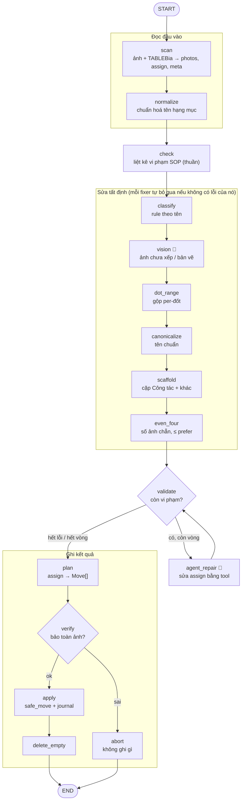
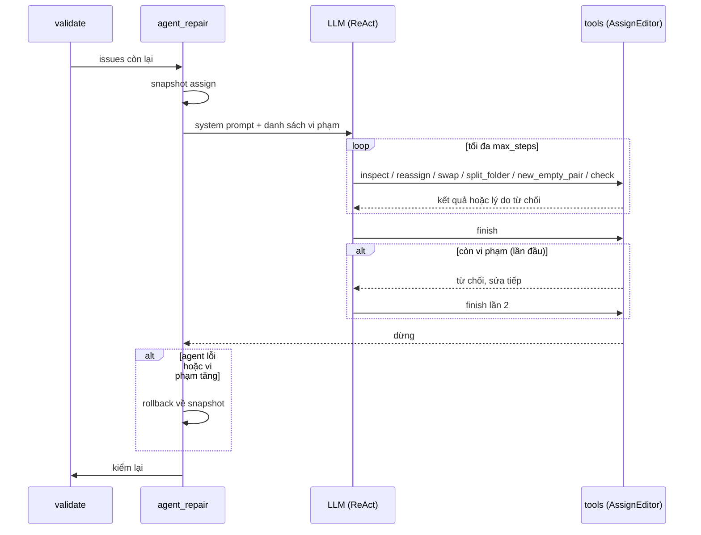

# PIPELINE — luồng xử lý photo-sort

> Chỉ mô tả luồng xử lý. Tổng thể kiến trúc: [KIEN_TRUC.md](KIEN_TRUC.md).

## 1. Pipeline — vòng reconcile (LangGraph)

🤖 = node gọi LLM; thiếu `LLM_API_KEY` thì bỏ qua mềm.

| Node | Việc | LLM |
|---|---|---|
| `scan` | Đọc trạm và TABLEBia → `photos`, `assign` (thư mục hiện tại → ảnh), `meta`. Loại ảnh hỏng | |
| `normalize` | Chuẩn hoá tên và số hạng mục | |
| `check` | Liệt kê vi phạm SOP của đầu vào. Hàm thuần, không sửa gì | |
| `classify` | Khớp rule theo tên: mỗi ảnh → một thư mục đích | |
| `vision` | Xem ảnh chưa xếp được hoặc nghi là bản vẽ. Có cache | ✓ |
| `dot_range` | Gộp thư mục theo từng đốt thành 2 cực trị (`[[dot_range]]`) | |
| `canonicalize` | Đưa tên thư mục con về tên chuẩn `[[subfolders]]` | |
| `scaffold` | Bảo đảm mỗi hạng mục có ≥ 2 thư mục "Công tác" (chẵn) và 1 "Hình ảnh khác" | |
| `even_four` | Số ảnh mỗi thư mục chẵn và ≤ `prefer_images` | |
| `validate` | Kiểm lại các bất biến cấu trúc → `issues` | |
| `agent_repair` | Sửa phần còn sót (§2). Chạy theo vòng, tối đa `_MAX_REPAIR_ITERS` | ✓ |
| `plan` | `assign` → danh sách `Move` (chuyển, đổi tên, PNG→JPG) | |
| `verify` | **Chặn cứng:** mỗi ảnh xuất hiện đúng 1 lần, không trùng (thư mục, tên). Sai thì abort | |
| `apply` | `safe_move` không đè, ghi journal nên resume được. Bỏ qua khi đã abort | |
| `delete_empty` | Xoá thư mục rỗng nằm ngoài kế hoạch | |

**Bất biến của graph:**
- Graph luôn có đủ 15 node. Không có cờ đổi hình dạng graph. Config chỉ mang dữ liệu.
- Mỗi fixer chạy đúng 1 lần và tự bỏ qua khi không có lỗi thuộc loại nó xử lý, nên vòng lặp luôn dừng.
- Fixer tự tính lại điều kiện từ `assign` hiện tại, không tin kết quả `check` cũ.
- Thiếu `LLM_API_KEY` thì `vision` và `agent_repair` bỏ qua mềm (`soft=True`), pipeline vẫn chạy hết.

**State:** node đọc và ghi qua `state(ctx)` (`domain/state.py`, dataclass `SortState`):
`photos, assign, meta, issues, unmatched, repair_iters, reviewed, moves, …`.
Tên các mục trong báo cáo lấy từ `domain/sections.py`.

## 2. Bước agent (`agent_repair`)

Agent ReAct (`langchain.agents.create_agent`) **chỉ sửa bảng `assign` trong bộ nhớ**. Ảnh không thể
rời khỏi hạng mục của nó, và `verify` vẫn chặn cứng ở phía sau.

| Tool | Tác dụng |
|---|---|
| `inspect(hang_muc)` | Xem các thư mục và ảnh của một hạng mục |
| `reassign(photo, to_folder)` | Chuyển ảnh sang thư mục **đã có**, cùng hạng mục |
| `swap(a, b)` | Đổi chỗ 2 ảnh, giữ nguyên số ảnh mỗi thư mục |
| `split_folder(folder)` | Thêm đúng 1 thư mục (sửa lỗi `odd_folders`) |
| `new_empty_pair(hm, base)` | Thêm 2 thư mục (chỉ dùng cho `too_few`) |
| `check()` | Trả danh sách vi phạm hiện tại |
| `look(hm, photos)` | Vision theo hạng mục. Có ngân sách, cache `look-cache.json`. Chỉ có khi `[agent] review = true` |
| `finish(note)` | Kết thúc. Lần đầu từ chối nếu còn vi phạm; lần thứ hai cho dừng |

**Lưới an toàn:**
- **Transaction:** chụp `assign` trước khi chạy. Hoàn tác nếu agent lỗi, hoặc nếu số vi phạm sau khi chạy nhiều hơn lúc đầu.
- **Giới hạn:** `recursion_limit = [agent].max_steps`, `max_look` ảnh cho mỗi lần chạy, số vòng `validate ⇄ agent_repair` có hạn.
- Mọi lần gọi tool được ghi vào mục báo cáo "agent log" và stream lên UI.

**Hướng tiếp theo (đề xuất):** tách `agent_repair` thành subgraph tường minh
`check → route → fix_{odd_folders,too_few} (luật, không LLM) | llm_fix → verify → rollback?`.
Lỗi đơn giản sẽ được sửa bằng luật, tất định và không tốn tiền. LLM chỉ xử lý phần còn lại.

